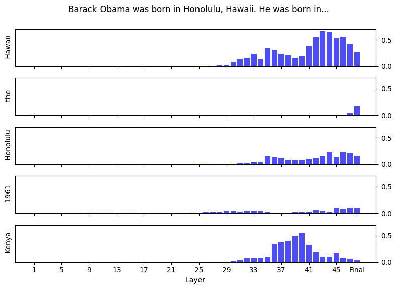

# Confident Adaptive Language Modeling 🫶 Contrastive Decoding

The [Contrastive Decoding](https://arxiv.org/abs/2210.15097) paper describes a technique to product higher quality text from language models by using the difference between predictions from a large LM (called the expert, e.g. OPT-13B), and a small LM (called the amateur, e.g. OPT-125M). This repository contains the code for an experiment to see whether we can use early exit, as described in the [Confident Adaptive Language Modeling](https://arxiv.org/abs/2207.07061) paper, in lieu of the amateur model to reduce the computational cost of contrastive decoding.

## Experimental Setup

We'll use the [GPT-2 XL](https://huggingface.co/gpt2-xl) model since it was also used in the Contrastive Decoding paper. GPT-2 has a [pre-LayerNorm](https://arxiv.org/abs/2002.04745) decoder-only transformer architecture with tied weights in the token embedding matrix and the linear layer of the language modeling head.

### Early Exit

The tied weights introduces a complication because the CALM paper uses an 8 layer T5 1.1 model for their experiments which does not share input and output embeddings. They do, however, share output embeddings for the intermediate layer softmax predictions with the top one. This turns out to work well for GPT-2 as well, meaning we don't need to do any additional training to get the early exit logits. We just need to apply the final layer norm to the intermediate layer logits and then apply the same language modeling head.


Here's an example of how logit probabilities evolve as we move through layers of the model for a sample input sequence.



### Contrastive Decoding

The key idea behind the contrastive decoding technique is to push model predictions away from predictions made by the smaller language model. However this introduces false positives and negatives for tokens that have low probability in the expert model. To address this, we filter out tokens that have a probability lower than α times the maximum token probability at that position. The paper uses α = 0.1.

Once low probability tokens are filtered out, tokens are scored using the difference between log probabilities from the expert and amateur models. The paper also finds that a temperature of 0.5 on the amateur model provides the best results. Beam search (with a beam size of 5) is used to find the best sequence of tokens.

The `generate.py` implements contrastive decoding with beam search using this approach. You can run it like this:

```
python generate.py -p <prompt>
```

## Results

**Prompt**: A version of Sonic the Hedgehog was developed by Ancient and released in 1991 for Sega’s 8-bit consoles, the Master System and Game

| Decoding Method | Output |
| --- | --- |
| Beam Search | **A version of Sonic the Hedgehog was developed by Ancient and released in 1991 for Sega’s 8-bit consoles, the Master System and Game** Gear.<br><br>Sonic the Hedgehog (1991)<br><br>Sonic the Hedgehog (1991)<br><br>Sonic the Hedgehog (1991)<br><br>Sonic the Hedgehog (1991)<br><br>Sonic the Hedgehog ( |
| Contrastive | **A version of Sonic the Hedgehog was developed by Ancient and released in 1991 for Sega’s 8-bit consoles, the Master System and Game** Gear, with the third level named after his blue, round ball of light, the Blue Chaos Emerald, the Super Chaos Emerald's light-up stage. This level, in its first two segments, has a central, open stage in the sky. A bridge, on a very narrow and high-wire, will open, with an upside down bridge.<br><br>A second, and a very short |

**Prompt**: The 40-metre-long (131 ft 3 in) hangar was 20 metres (65 ft 7 in) wide forward and 11 metres

| Decoding Method | Output |
| --- | --- |
| Beam Search | **The 40-metre-long (131 ft 3 in) hangar was 20 metres (65 ft 7 in) wide forward and 11 metres** (36 ft 3 in) wide in the rear.<br><br>The hangar was designed to accommodate a single-seat, single-pilot aircraft.<br><br>The hangar was designed to accommodate a single-seat, single-pilot aircraft.<br><br>The |
| Contrastive | **The 40-metre-long (131 ft 3 in) hangar was 20 metres (65 ft 7 in) wide forward and 11 metres** (35 ft 9 in) in back and could house an F-106 in two vertical or a VF-86D in two horizontal.<br><br>It also carried the TACAN-6 (TRANSPORTER AIMED ANTENNAS) communications and electronic equipment that the Navy and USMC would later equip to help their ground units to spot the Soviet's VVS V |

**Prompt**: The old Bintulu airport was built in 1955 in the town centre. It once held the Guinness World Record of nearest airport to town. On 19 December

| Decoding Method | Output |
| --- | --- |
| Beam Search | **The old Bintulu airport was built in 1955 in the town centre. It once held the Guinness World Record of nearest airport to town. On 19 December** 2013, the airport was closed due to lack of demand.<br><br>The new airport is located on the outskirts of Bintulu. It was built on the site of the old Bintulu airport.<br><br>The new Bintulu airport |
| Contrastive | **The old Bintulu airport was built in 1955 in the town centre. It once held the Guinness World Record of nearest airport to town. On 19 December** the new Bintulu International Airport, the new international gateway, is now in full swing and has just become the new major international gateway, in its first full day. It's an international gateway. We can do international, and domestic and business and private and some things. But, in a country, I can do two, and then, for my private and some of the government's, and |

## Conclusion

We find that it is possible to implement contrastive decoding using early exit. This method doesn't require any additional training, and does not require running inference on a smaller language model, leading to a smaller compute footprint. The results we get are a significant improvement over the repetitiveness of beam search, and qualitatively appear to be similar to the results in the contrastive decoding paper. Further work is needed to evaluate the quality of the results quantitatively.

Not requiring a smaller language model to run inference on is a significant advantage of this approach. This means it is possible to use this on larger models like Llama 2 7B, where a smaller amateur model is not available.